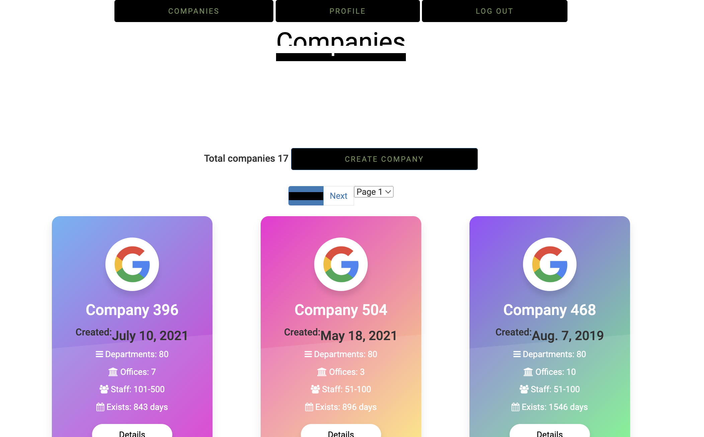
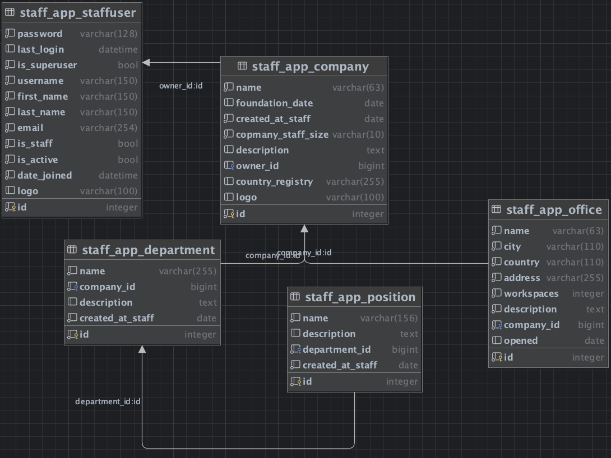

# StaffUs service
<h3>Service for management companies and departments.</h3>




## Demo online
Deployed here: [staffus.techone.pp.ua](https://staffus.techone.pp.ua/clientarea/)

Click "**Test User**" to login as a user with prepared data, or register [here](https://staffus.techone.pp.ua/accounts/register/).


## Database structure:



## Features

1. **User Registration and Authentication**:

  - Users can register on website.
  User authentication is implemented using Django's authentication system.

2. **User Profile**:

  - Users have profile pages displaying their information. 
  - Users can update their usernames, names, surnames, emails, and logos through separate views.
  
3. **Company Management**:

  - Users can create, update, and delete companies.
  - Users can view details and a list of their own companies.

4. **Department Management**:

  - Users can create, update, and delete departments within a company.
  - Users can view details and a list of departments for a specific company.

5. **Position Management**:

  - Users can create, update, and delete positions within a department.
  - Users can view details and a list of positions for a specific department.

6. **Office Management**:

  - Users can create, update, and delete offices for a company.
  - Users can view details and a list of offices for a specific company.

7. **User Interface and Navigation**:

  - The website provides a user-friendly interface.
  - It offers a navigation system with views for creating, updating, and deleting entities like companies, departments, positions, and offices.

## Installation

**For windows:**
```shell
git clone https://github.com/maxkatkalov/staff-system.git
cd staff-system
python -m venv venv
venv\Scripts\activate
pip install -r requirements.txt
python manage.py makemigrations
python manage.py migrate
python manage.py loaddata staff_system_data.json
python manage.py runserver
```

**For Mac:**
```shell
git clone https://github.com/maxkatkalov/staff-system.git
cd staff-system
python3 -m venv venv
source venv/bin/activate
pip install -r requirements.txt
python manage.py makemigrations
python manage.py migrate
python manage.py loaddata staff_system_data.json
python manage.py runserver
```
